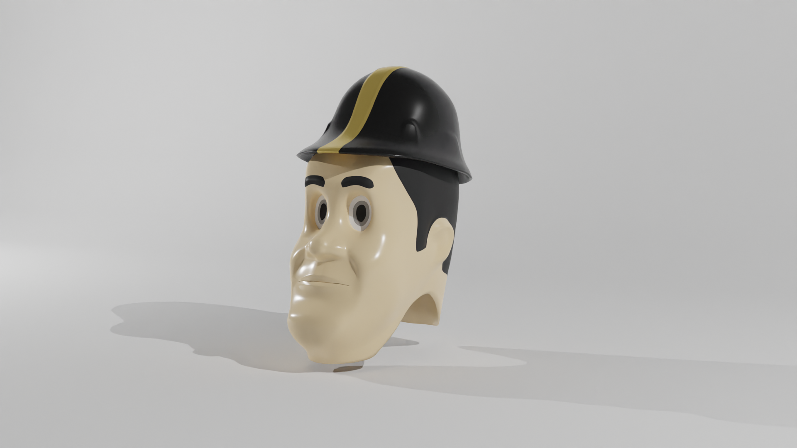

# Pete's Head

*because nobody's made a public one so far*

Maybe he's just too creepy? I don't really know, but it *was* fun to make regardless.

The model is rigged and animation-ready, but is *not* manifold for 3D printing; some post processing will be needed for that.

